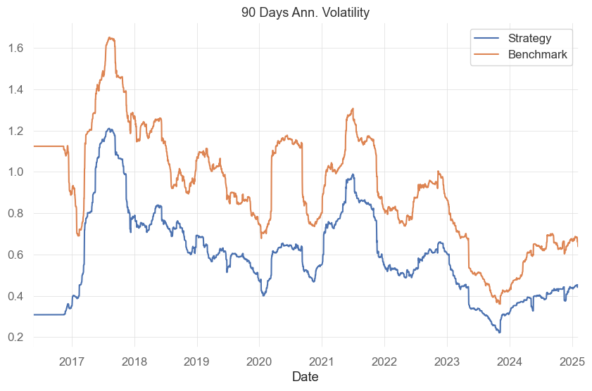
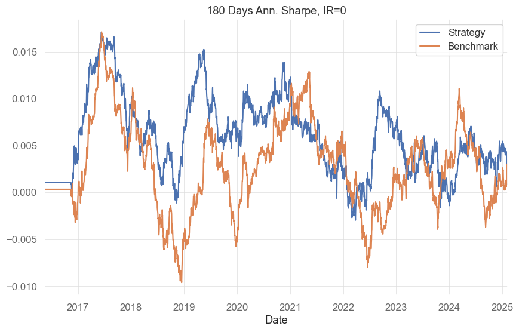
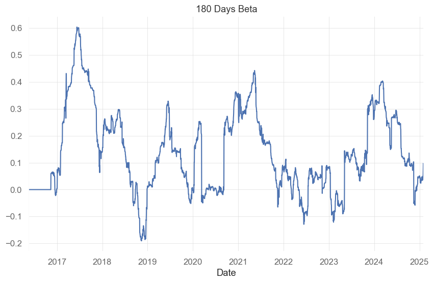
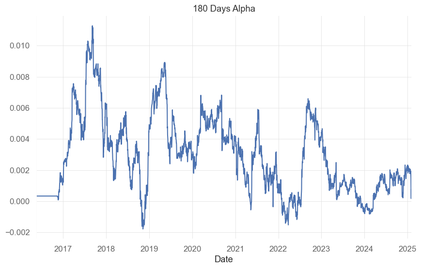
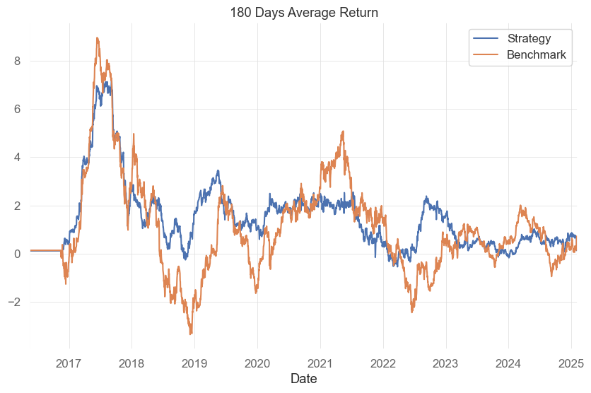

<!-- WARNING: THIS FILE WAS AUTOGENERATED! DO NOT EDIT! -->

## Tables

Performance tables. I am using quatstats package in order to build
performance tables.

------------------------------------------------------------------------

<a
href="https://github.com/silvaac/perform_stats/blob/main/perform_stats/tables.py#L12"
target="_blank" style="float:right; font-size:smaller">source</a>

### perf_stats

>  perf_stats (x, benchmark=None, riskfree_rate=0, date_col='Date')

*Initialize self. See help(type(self)) for accurate signature.*

## Exemples

Load sample data for demonstration. Remove tz info to avoid issues w/qs
library functions.

``` python
import pandas as pd
from perform_stats.tables import *
# Read in strategy
strategy = pd.read_parquet('strategy.parquet')
# Read in benchmark
bench = pd.read_parquet('benchmark.parquet')
# Join them
df = pd.merge(strategy, bench, on='Date', how='inner')
df = df.tz_localize(None) # avoid issues w/qs library
print(df)
```

                 pnl_sim       ETH
    Date                          
    2016-05-18  0.000000  0.013846
    2016-05-19  0.000000  0.130501
    2016-05-20  0.000000 -0.048993
    2016-05-21  0.000000  0.000000
    2016-05-22  0.000000  0.000000
    ...              ...       ...
    2025-02-02  0.055932 -0.079419
    2025-02-03 -0.055593  0.005008
    2025-02-04  0.014117 -0.052555
    2025-02-05  0.000663  0.020581
    2025-02-06  0.016759  0.004418

    [3187 rows x 2 columns]

Use class perf_stats to compute performance statistics and drawdown
statistics.

``` python
performance = perf_stats(df['pnl_sim'],benchmark=df['ETH'])
ret,risk = performance.return_performance()
print(ret)
print(risk)
```

                     Benchmark    Strategy
    Start Period    2016-05-18  2016-05-18
    End Period      2025-02-06  2025-02-06
    Avg (Day ann.)        1.08        1.45
    Vol (Day ann.)        0.97        0.63
    Sharpe                1.11        2.29
    MTD                  -0.15        0.02
    YTD                  -0.16       -0.18
    3M                    0.16       -0.02
    6M                    0.16        0.05
    1Y                    0.22        0.47
    3Y (ann.)             0.01        0.49
    5Y (ann.)             0.42        0.67
                       Benchmark Strategy
    Max Drawdown           -0.94    -0.46
    Longest DD Days         1186      220
    Avg. Drawdown          -0.17    -0.06
    Avg. Drawdown Days        83       15

Drawdown statistics

``` python
a,_,_ = performance.dd_stats()
print(a)
```

              start      valley         end  days  max drawdown  99% max drawdown
    142  2021-12-10  2022-03-09  2022-07-17   220    -45.662228        -44.502931
    47   2018-01-10  2018-03-19  2018-04-18    99    -33.991516        -31.702138
    52   2018-06-23  2018-08-10  2018-12-05   166    -33.869321        -33.664651
    137  2021-05-23  2021-06-16  2021-08-08    78    -31.054742        -31.046791
    183  2024-12-12  2025-02-03  2025-02-06    57    -29.802162        -29.607148

Trailing 180 days Annualized Volatility

``` python
import matplotlib.pyplot as plt
roll_vol,roll_vol_bench = performance.roll_volatility(window=180)
roll_vol.plot(title='90 Days Ann. Volatility',label='Strategy')
roll_vol_bench.plot(label='Benchmark')
plt.legend()
```



Trailing 180 days Sharp Ratio with zero Risk-Free Rate

``` python
roll_sr,roll_sr_bench = performance.roll_sharpe(window=180)
roll_sr.plot(title='180 Days Ann. Sharpe, IR=0',label='Strategy')
roll_sr_bench.plot(label='Benchmark')
plt.legend()
```



Trailing 180 days Beta and zero Risk-Free Rate. Beta against the
benchmark is calculated as rolling linear regression coefficient between
the strategy and benchmark. In practical terms, the algorithm is simply
the covariance of the strategy with the benchmark divided by the
variance of the benchmark.

``` python
beta = performance.roll_beta(window=180)
beta.plot(title='180 Days Beta',label='Strategy')
```



Trailing 180 days Alpha and zero Risk-Free Rate. Alpha is the excess
return of the strategy over the risk-free rate. In practical terms, the
algorithm is simply the mean of the strategy minus the risk-free rate
minus the benchmark’s mean times the beta.

``` python
alpha = performance.roll_alpha(window=180)
alpha.plot(title='180 Days Alpha',label='Strategy')
```



Trailing annualized 180 days Average Return. Average return is
calculated as the rolling mean of the strategy multiplied by the number
of data points in one year.

``` python
average_return, average_return_bench = performance.roll_average_return(window=180)
average_return.plot(title='180 Days Average Return',label='Strategy')
average_return_bench.plot(label='Benchmark')
plt.legend()
```



Monthly Returns table with last column EOY values. Monthly returns are
calculated by compounding daily returns.

``` python
print(performance.monthly_returns())
```

<div>
<style scoped>
    .dataframe tbody tr th:only-of-type {
        vertical-align: middle;
    }
&#10;    .dataframe tbody tr th {
        vertical-align: top;
    }
&#10;    .dataframe thead th {
        text-align: right;
    }
</style>

<table class="dataframe" data-quarto-postprocess="true" data-border="1">
<thead>
<tr style="text-align: right;">
<th data-quarto-table-cell-role="th"></th>
<th data-quarto-table-cell-role="th">JAN</th>
<th data-quarto-table-cell-role="th">FEB</th>
<th data-quarto-table-cell-role="th">MAR</th>
<th data-quarto-table-cell-role="th">APR</th>
<th data-quarto-table-cell-role="th">MAY</th>
<th data-quarto-table-cell-role="th">JUN</th>
<th data-quarto-table-cell-role="th">JUL</th>
<th data-quarto-table-cell-role="th">AUG</th>
<th data-quarto-table-cell-role="th">SEP</th>
<th data-quarto-table-cell-role="th">OCT</th>
<th data-quarto-table-cell-role="th">NOV</th>
<th data-quarto-table-cell-role="th">DEC</th>
<th data-quarto-table-cell-role="th">EOY</th>
</tr>
</thead>
<tbody>
<tr>
<td data-quarto-table-cell-role="th">2016</td>
<td>0.000000</td>
<td>0.000000</td>
<td>0.000000</td>
<td>0.000000</td>
<td>0.000000</td>
<td>0.027083</td>
<td>-0.002002</td>
<td>-0.037465</td>
<td>-0.039696</td>
<td>0.120242</td>
<td>0.033823</td>
<td>0.179573</td>
<td>0.294323</td>
</tr>
<tr>
<td data-quarto-table-cell-role="th">2017</td>
<td>0.245378</td>
<td>0.298094</td>
<td>1.705055</td>
<td>0.303694</td>
<td>1.442861</td>
<td>0.307310</td>
<td>0.499699</td>
<td>0.334430</td>
<td>-0.061243</td>
<td>-0.013977</td>
<td>0.104696</td>
<td>0.534898</td>
<td>56.187238</td>
</tr>
<tr>
<td data-quarto-table-cell-role="th">2018</td>
<td>0.244564</td>
<td>-0.086251</td>
<td>0.018412</td>
<td>0.297282</td>
<td>-0.004074</td>
<td>0.155875</td>
<td>-0.266392</td>
<td>0.193204</td>
<td>0.101950</td>
<td>-0.127561</td>
<td>0.200323</td>
<td>0.963456</td>
<td>2.430327</td>
</tr>
<tr>
<td data-quarto-table-cell-role="th">2019</td>
<td>0.149708</td>
<td>0.277964</td>
<td>0.072318</td>
<td>0.042929</td>
<td>0.147426</td>
<td>0.204460</td>
<td>0.305041</td>
<td>-0.193311</td>
<td>0.128122</td>
<td>0.242724</td>
<td>-0.028250</td>
<td>0.065695</td>
<td>2.470972</td>
</tr>
<tr>
<td data-quarto-table-cell-role="th">2020</td>
<td>0.247332</td>
<td>0.294855</td>
<td>0.322072</td>
<td>-0.020038</td>
<td>0.033682</td>
<td>0.005880</td>
<td>0.328446</td>
<td>0.437837</td>
<td>0.306867</td>
<td>-0.112232</td>
<td>0.331719</td>
<td>0.044407</td>
<td>5.706052</td>
</tr>
<tr>
<td data-quarto-table-cell-role="th">2021</td>
<td>0.218055</td>
<td>0.274181</td>
<td>0.034391</td>
<td>0.014588</td>
<td>0.149910</td>
<td>0.258786</td>
<td>-0.043322</td>
<td>-0.029313</td>
<td>-0.028842</td>
<td>-0.015668</td>
<td>0.307427</td>
<td>-0.072388</td>
<td>1.538337</td>
</tr>
<tr>
<td data-quarto-table-cell-role="th">2022</td>
<td>-0.163260</td>
<td>-0.193772</td>
<td>0.032276</td>
<td>0.116749</td>
<td>0.139956</td>
<td>0.191485</td>
<td>0.303305</td>
<td>0.258969</td>
<td>0.005962</td>
<td>0.007318</td>
<td>0.178209</td>
<td>-0.031826</td>
<td>1.003376</td>
</tr>
<tr>
<td data-quarto-table-cell-role="th">2023</td>
<td>0.073890</td>
<td>0.075979</td>
<td>-0.146340</td>
<td>0.106180</td>
<td>0.049479</td>
<td>0.131816</td>
<td>0.030242</td>
<td>-0.047567</td>
<td>-0.072191</td>
<td>-0.010755</td>
<td>0.042876</td>
<td>-0.006438</td>
<td>0.209451</td>
</tr>
<tr>
<td data-quarto-table-cell-role="th">2024</td>
<td>0.049431</td>
<td>0.170827</td>
<td>0.088214</td>
<td>-0.060672</td>
<td>0.250839</td>
<td>-0.147195</td>
<td>-0.078230</td>
<td>0.184755</td>
<td>0.152258</td>
<td>-0.079885</td>
<td>0.222245</td>
<td>-0.016149</td>
<td>0.865347</td>
</tr>
<tr>
<td data-quarto-table-cell-role="th">2025</td>
<td>-0.203651</td>
<td>0.024563</td>
<td>0.000000</td>
<td>0.000000</td>
<td>0.000000</td>
<td>0.000000</td>
<td>0.000000</td>
<td>0.000000</td>
<td>0.000000</td>
<td>0.000000</td>
<td>0.000000</td>
<td>0.000000</td>
<td>-0.184090</td>
</tr>
</tbody>
</table>

</div>
